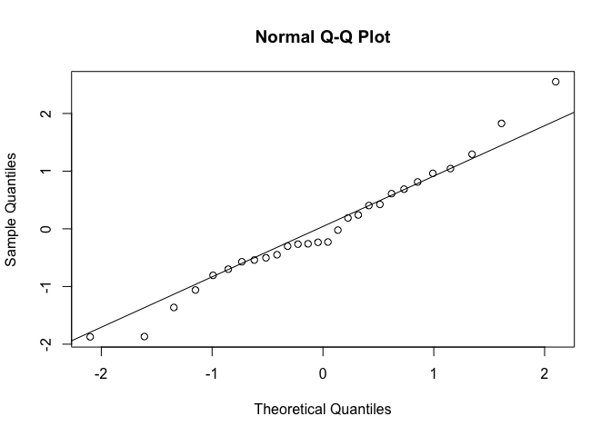

# extr

The goal of **extr** is to estimate finite-horizon extinction risk from
population time series under a density-independent (drifted Wiener)
model, with support for both naive MLE and
observation-error-and-autocovariance-robust (OEAR) variance estimation.

## Installation

``` r

# CRAN release
install.packages("extr")

# GitHub version (may be newer than CRAN)
# install.packages("remotes") # if needed
remotes::install_github("hakoyamah/extr")
```

## Main function

### `ext_di()`

[`ext_di()`](reference/ext_di.md) estimates population growth rate,
variance, and extinction probability from a time series of population
sizes. It supports two variance estimators: the default naive
maximum-likelihood estimator (`method = "naive"`) and an
observation-error-and-autocovariance-robust estimator
(`method = "oear"`). Confidence intervals for extinction probability are
based on the $`w`$-$`z`$ method.

## Example

The following example uses the Yellowstone grizzly bear time series from
Dennis et al. (1991), digitized from Fig. 5. The published series is a
running 3-year sum (3-year moving total).

``` r

library(extr)
```

``` r

dat <- data.frame(
  Time = 1959:1987,
  Population = c(
    44, 47, 46, 44, 46, 45, 46, 40, 39, 39, 42, 44, 41, 40,
    33, 36, 34, 39, 35, 34, 38, 36, 37, 41, 39, 51, 47, 57, 47
  )
)
```

Probability of decline to 1 individual within 100 years:

``` r

ext_di(dat, th = 100)
#> --- Estimates ---
#>                                                       Estimate
#> Probability of decline to 1 within 100 years (MLE): 9.4128e-05
#> Growth rate (MLE):                                   0.0023556
#> Environmental variance (MLE):                          0.01087
#> Unbiased variance:                                    0.011273
#> AIC for the distribution of N:                          165.06
#>                                                                        CI
#> Probability of decline to 1 within 100 years (MLE):  (1.4586e-13, 0.5653)
#> Growth rate (MLE):                                  (-0.038814, 0.043525)
#> Environmental variance (MLE):                       (0.0070464, 0.020885)
#> Unbiased variance:                                                      -
#> AIC for the distribution of N:                                          -
#> 
#> --- Data Summary ---
#>                               Value
#> Current population size, nq:     47
#> xd = ln(nq / ne):            3.8501
#> Sample size, q + 1:              29
#> 
#> --- Input Parameters ---
#>                                                         Parameter
#> Time unit:                                                  years
#> Extinction threshold of population size, ne:                    1
#> Time window for extinction risk evaluation (years), th:     100.0
#> Significance level, alpha:                                   0.05
```

Probability of decline to 10 individuals within 100 years:

``` r

ext_di(dat, th = 100, ne = 10)
#> --- Estimates ---
#>                                                       Estimate
#> Probability of decline to 10 within 100 years (MLE):  0.096852
#> Growth rate (MLE):                                   0.0023556
#> Environmental variance (MLE):                          0.01087
#> Unbiased variance:                                    0.011273
#> AIC for the distribution of N:                          165.06
#>                                                                         CI
#> Probability of decline to 10 within 100 years (MLE):  (1.0699e-05, 0.9898)
#> Growth rate (MLE):                                   (-0.038814, 0.043525)
#> Environmental variance (MLE):                        (0.0070464, 0.020885)
#> Unbiased variance:                                                       -
#> AIC for the distribution of N:                                           -
#> 
#> --- Data Summary ---
#>                               Value
#> Current population size, nq:     47
#> xd = ln(nq / ne):            1.5476
#> Sample size, q + 1:              29
#> 
#> --- Input Parameters ---
#>                                                         Parameter
#> Time unit:                                                  years
#> Extinction threshold of population size, ne:                   10
#> Time window for extinction risk evaluation (years), th:     100.0
#> Significance level, alpha:                                   0.05
```

With QQ plot:

``` r

ext_di(dat, th = 100, ne = 10, qq_plot = TRUE)
```



``` R
#> --- Estimates ---
#>                                                       Estimate
#> Probability of decline to 10 within 100 years (MLE):  0.096852
#> Growth rate (MLE):                                   0.0023556
#> Environmental variance (MLE):                          0.01087
#> Unbiased variance:                                    0.011273
#> AIC for the distribution of N:                          165.06
#>                                                                         CI
#> Probability of decline to 10 within 100 years (MLE):  (1.0699e-05, 0.9898)
#> Growth rate (MLE):                                   (-0.038814, 0.043525)
#> Environmental variance (MLE):                        (0.0070464, 0.020885)
#> Unbiased variance:                                                       -
#> AIC for the distribution of N:                                           -
#> 
#> --- Data Summary ---
#>                               Value
#> Current population size, nq:     47
#> xd = ln(nq / ne):            1.5476
#> Sample size, q + 1:              29
#> 
#> --- Input Parameters ---
#>                                                         Parameter
#> Time unit:                                                  years
#> Extinction threshold of population size, ne:                   10
#> Time window for extinction risk evaluation (years), th:     100.0
#> Significance level, alpha:                                   0.05
```

Using the OEAR variance estimator:

``` r

ext_di(dat, th = 100, method = "oear")
#> --- Estimates ---
#>                                                                Estimate
#> Probability of decline to 1 within 100 years (OEAR plug-in): 5.1099e-10
#> Growth rate (MLE):                                            0.0023556
#> Process variance (OEAR):                                      0.0043077
#> AR(1) pre-whitening rho:                                       -0.52522
#> Bartlett lag truncation (j):                                          4
#>                                                                                  CI
#> Probability of decline to 1 within 100 years (OEAR plug-in): (1.6408e-23, 0.027088)
#> Growth rate (MLE):                                            (-0.038814, 0.043525)
#> Process variance (OEAR):                                     (0.0027924, 0.0082765)
#> AR(1) pre-whitening rho:                                                          -
#> Bartlett lag truncation (j):                                                      -
#> 
#> --- Data Summary ---
#>                               Value
#> Current population size, nq:     47
#> xd = ln(nq / ne):            3.8501
#> Sample size, q + 1:              29
#> 
#> --- Input Parameters ---
#>                                                         Parameter
#> Time unit:                                                  years
#> Extinction threshold of population size, ne:                    1
#> Time window for extinction risk evaluation (years), th:     100.0
#> Significance level, alpha:                                   0.05
```
